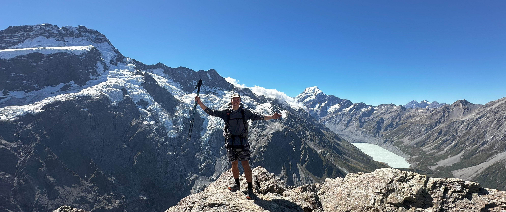

<h1 align="center">Hi 👋, I'm Tom</h1>
<h3 align="center">A software engineer with a background in physics</h3>
<h5 align="center">... and a love for mountains.<h5>

  

### About Me!

- 🔭 I’m interested in projects that solve real problems and have a clear, positive impact.

- 🌱 Always learning, always up for a challenge.

- 💬 Ask me anything about **Python** - it's my go-to for data, APIs, and fast prototyping.

---

### 🧰 Tech Stack

<ul>
  <li>
    
  <b>Python</b> - ML models, automation, APIs or anything scripting
  </li>
  <li>
    
    <b>CSharp</b> - Building rock solid and resilient microservices, backend systems, and structured architecture
  </li>
  <li>
    
    <b>Azure</b> - Pulumi infrastructure as code deployments
  </li>
  <li>
    
    <b>.NET</b> - Framework
  </li>
  <li>
    
    <b>Jebrains Rider</b> - Daily Driver
  </li>
  <li>
    🚀 Always happy jumping into new tools and unfamiliar codebases
  </li>
</ul>

---

### 🧭 Projects That Matter

A few things I’ve worked on or am building now:

- 🧳 [Wondur](https://github.com/WondurTravel):  Born during COVID, aimed at helping local businesses recover

- 🦇 [Bat-o-Meter](https://github.com/TomSB1423/Bat-O-Meter): Detecting bat directionality from video input (eco-collab with a friend)

- 📁 [url-2-phone-sms](https://github.com/TomSB1423/url-2-phone-sms): Making it easier to transfer files from my phone to PC. A problem I have always had with iPhone & Windows...

- 💡 [wizLightController](https://github.com/TomSB1423/wizLightController): Macro keys to control my smart lights at home

- 📈 Data Workflows: Lightweight ML models with real-world use cases (forecasting, classification, text analysis).

> [!NOTE]
> I care less about fancy demos and more about whether it works, is useful, and can be maintained by the next person.

---

### 💡 What I Look For

Projects with real-world impact - tools that help people or solve nagging problems

Ideas that challenge convention for a good reason

If you're working on something useful, unusual, or tough to build - I’d love to hear about it.

---

### 🥾 Outside of Tech

Sometimes the best debugging happens outdoors.

I recently walked the full length of New Zealand via the Te Araroa trail - 3,040km of remote beaches, forests, mountains, and mud. That kind of challenge teaches you a lot about patience, focus, and staying calm when things get messy - lessons that apply directly to software engineering.

---

### 🌍 Lets Connect!

